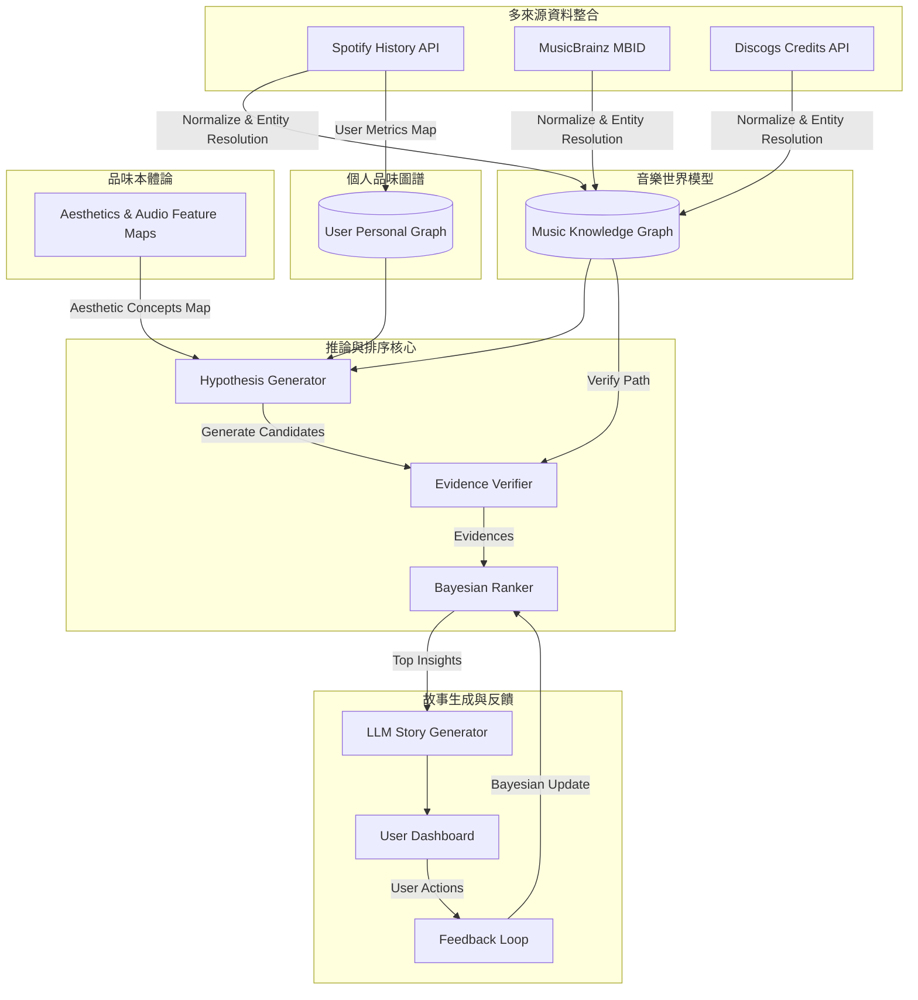

# Taste Intelligence Engine (TIE) — System Architecture Spec v1.0

本文件定義 **Taste Intelligence Engine (TIE)** 的系統架構、服務模組邊界以及端到端的資料流向。

---

## 1. 系統整體資料流 (Overall Data Flow)

TIE 採用 8 層分層架裝，將原始聆聽行為數據轉化為具備證據支持的個人品味洞察。

---

## 2. 八層架構詳細邊界說明 (Layer Boundaries)

### Layer 1 — Multi-source Data Integration {多來源資料整合層}
*   **職責**：從 Spotify API、MusicBrainz、Discogs 等獲取非結構化與半結構化數據。
*   **邊界輸入**：`Spotify Token`、`Artist Name`、`ISRC/UPC` 等標識符。
*   **邊界輸出**：`Unified Song Entity` {統一歌曲實體}。

### Layer 2 — Music Knowledge Graph (MKG) {音樂世界模型層}
*   **職責**：儲存客觀的音樂歷史、製作抵免（Credits）、風格傳承（Influences）與採樣關係。
*   **邊界輸入**：實體與關係元數據。
*   **邊界輸出**：提供 `Graph Query API` 給推論核心進行路徑檢索與驗證。

### Layer 3 — Personal Taste Graph {個人品味圖譜層}
*   **職責**：映射使用者個人與音樂世界節點的互動程度。
*   **邊界輸入**：Spotify 播放軌跡與行為指標（跳過率、聆聽時長、重複次數）。
*   **邊界輸出**：使用者與特定 `Artist`、`Producer`、`Genre` 之間的權重關係。

### Layer 4 — Taste Ontology {品味本體論層}
*   **職責**：定義抽象的聽覺美學概念（如 `Analog Warmth`、`Minimalism`），並將其映射至實體音訊特徵（如 `acousticness`）與圖譜子結構。
*   **邊界輸入**：音訊特徵特徵區間與圖譜子拓撲定義。
*   **邊界輸出**：品味概念對應特徵篩選器（Filter）。

### Layer 5 — Hypothesis Engine {品味假說引擎}
*   **職責**：針對個人品味圖譜，自動衍生 50–100 個候選假說。
*   **邊界輸入**：Personal Taste Graph 權重。
*   **邊界輸出**：`CandidateHypothesis[]`。

### Layer 6 — Evidence Verification {證據驗證層}
*   **職責**：檢索 MKG 尋找能支持假說的完整證據鏈，剔除無事實支持的猜測。
*   **邊界輸入**：`CandidateHypothesis[]`。
*   **邊界輸出**：`VerifiedHypothesis` (附帶 `EvidenceChain[]`)。

### Layer 7 — Bayesian Insight Ranking {貝氏排序層}
*   **職責**：依據 `Evidence Strength` {證據強度}、`Surprise` {驚奇度} 與 `Novelty` {新穎性} 計算目標函數，對假說進行排序。
*   **邊界輸入**：`VerifiedHypothesis[]`。
*   **邊界輸出**：排序後的 `TasteInsight[]`。

### Layer 8 — Natural Language Insight Generator {自然語言生成層}
*   **職責**：將高分假說與證據鏈輸入 LLM，生成富有人文溫度與高度可解釋性的敘事。
*   **邊界輸入**：Top-ranked `TasteInsight` 與其證據鏈（不包含未驗證事實）。
*   **邊界輸出**：`Storytelling Output` 渲染於 Dashboard 上。

---

## 3. 設計原則 (Design Principles)
1.  **分離推論與渲染**：LLM 僅做為語言修辭與改寫器，絕不允許 LLM 自行推導或虛構圖譜中不存在的事實。
2.  **單一事實源**：`Music Knowledge Graph` 是系統驗證所有假說的唯一真實源（Single Source of Truth）。
