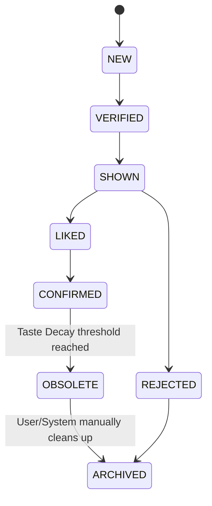

# TIE Core Reasoning Specification v1.2

本文件正式將 TIE 重構命名為 **Taste Intelligence Model (TIM)** {品味智能模型}，並定義動態推理規則（Dynamic Inference Rules）、貝氏遺忘曲線、推理軌跡（Reasoning Trace）以及新增的狀態生命週期。

---

## 1. Taste Intelligence Model (TIM) 定義與關係

TIM 是整個品味推理系統的最上層實體，其架構由以下六大子模組組成：

```
Taste Intelligence Model (TIM)
│
├── Music Knowledge Graph (Memory {記憶})
├── Personal Taste Graph (Personal Memory {個人記憶})
├── Taste Ontology (Semantic Layer {語義層})
├── Taste Reasoning Engine (Inference {推理/大腦})
├── Bayesian Ranker (Decision {決策})
└── Narrator (Communication {嘴巴})
```

---

## 2. 動態推理規則數據化 (Dynamic Inference Rules)

為了確保規則的擴充性，`Taste Reasoning Engine (TRE)` 不再使用寫死的 if-else 邏輯，而是動態讀取 JSON/YAML 配置之規則文件（存放於 `rules/` 目錄中）。

### 規則 Schema (Rule Configuration Schema)
```typescript
export interface InferenceRule {
  readonly id: string;
  readonly description: string;
  readonly priority: number;           // 執行優先級
  readonly conditions: readonly {
    readonly pattern: string;          // 匹配路徑，例如 "Played(user, songA) && Produced(songA, producer)"
  }[];
  readonly output: {
    readonly relation: string;         // 推導出的關係，如 "SharedProducer(user, producer)"
    readonly confidenceMultiplier: number; // 乘積信賴度
  };
}
```

---

## 3. 貝氏遺忘曲線 (Bayesian Time Decay)

為了反映使用者品味的動態演化，使用者的歷史聆聽頻次與反饋數據導入時間衰減係數（Time Decay）：

$$weight(t) = e^{-\lambda \cdot \Delta t}$$

*   $\Delta t$：行為發生距今的時間差（以天為單位）。
*   $\lambda$：**品味衰減常數（Taste Decay Constant）**。例如設定 $\lambda = 0.0077$，代表約 90 天前的聆聽與反饋權重會折半減衰。

此係數直接作用於 $Prior_{User}$ 與 $Prior_{Feedback}$，使三年前的品味偏好在先驗機率中的比重大幅降低。

---

## 4. 洞察生命週期 (Insight Lifecycle v1.2)

狀態機正式引入 `OBSOLETE` {退役} 狀態，區分「歷史存在但已不符當上品味」與「完全退出」的狀態。



*   **OBSOLETE**：該品味分析在過去是真實且被使用者 Liked，但由於 `Time Decay` 累積，目前其後驗機率已低於臨界閾值，正式轉為退役，不再顯示於 Active Dashboard。

---

## 5. 推理軌跡 (Reasoning Trace)

每一個產出的 `TasteInsight` 都必須包含 `ReasoningTrace` 陣列，記錄所有參與推導的 Rule ID，以供前端 Debug 溯源與 Explainability：

```typescript
export interface ReasoningTrace {
  readonly ruleId: string;
  readonly matchedPath: readonly string[]; // 匹配的實體 ID 路徑
  readonly timestamp: string;
}

export interface TasteInsight {
  readonly id: string;
  readonly hypothesisId: string;
  readonly evidenceChains: readonly EvidenceChain[];
  readonly reasoningTrace: readonly ReasoningTrace[]; // 推理軌跡追蹤
}
```
