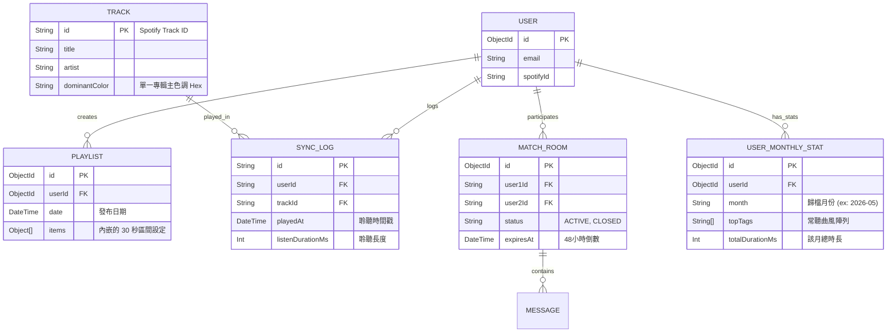

# Ditto (Music Vibe) - Database Schema 設計方案

本文件定義 Ditto 專案的核心資料庫結構。因系統採用 Next.js，我們預設使用 **Prisma ORM** 作為與 **MongoDB** 溝通的橋樑。

## 團隊檢閱 (Review Required)
> [!IMPORTANT]
> 請確認以下設計是否符合模組的需求：
> 1. **數據端 (Data Layer)**：`SyncLog` 與 `Track` 的結構是否足以支撐「多時間維度 (日/週/月/季/年)」的數據聚合查詢？
> 2. **社交端 (Social Layer)**：`Playlist` (包含 30 秒片段的 `PlaylistItem`) 與 `MatchRoom` (48 小時倒數) 的設計，是否能順利支撐配對演算法與 WebSocket 狀態管理？

## 1. 實體關聯圖 (ER Diagram)



## 2. 關鍵決策點設計說明

### 決策一：30 秒精華儲存機制 (採用 Document Embedding)
我們利用 MongoDB 的特性，將 30 秒片段直接作為**「內嵌物件 (Embedded Object)」**存於 `Playlist` 之中。
*   **作法**：在 `Playlist` 內宣告一個名為 `items` 的陣列，儲存 `trackId`, `startTime`, `endTime`。
*   **優勢**：消滅了多餘的 `PlaylistItem` 關聯表！讀取歌單時只要一次 Query 就能把 5 首自訂的 30 秒區間全部拿出來，效能與邏輯極度輕量。

### 決策二：歌單重複調用架構
*   **作法**：使用者每天可以創建一個新的 `Playlist`。若使用者今天想用跟昨天一樣的歌單，前端可以直接複製昨天歌單裡的 `items` 陣列，存進今天新生成的 `Playlist` 即可。
*   **優勢**：完整保留每一天的歷史交友紀錄。不會污染真實的音樂 Metadata (`Track`) 表，且完全免除了 SQL JOIN 帶來的效能損耗。

### 決策三：專輯主色調儲存
*   **作法**：在 `Track` 表中直接新增 `dominantColor` 欄位。
*   **優勢**：後端抓取 Spotify 資料時順便計算好色碼寫入資料庫。前端渲染時不需再用 Canvas 計算，直接讀取色碼變數套用在 CSS 背景，確保效能 60fps。

### 決策四：海量日誌壓縮歸檔 (符合免費版空間策略)
*   **作法**：`SyncLog` (原始日誌) 設定僅保留最近 30 天。透過每個月底的排程 (Cron Job)，將使用者的聆聽紀錄聚合，並壓縮寫入至 `UserMonthlyStat` 報表表中，隨後清除舊的 `SyncLog`。
*   **優勢**：將百萬筆的日誌明細，極度壓縮為「每人每月僅 1 筆」的輕量報表。確保 512MB 的免費版資料庫能在 100~500 人的活躍規模下，穩定運作數年不爆滿，同時完美支援前端「年度 / 季度回顧」的資料展現。

## 3. Prisma Schema 實作草稿

```prisma
generator client {
  provider = "prisma-client-js"
}

datasource db {
  provider = "mongodb"
  url      = env("DATABASE_URL")
}

model User {
  id            String   @id @default(auto()) @map("_id") @db.ObjectId
  email         String?  @unique
  spotifyId     String?  @unique
  appleMusicId  String?  @unique
  createdAt     DateTime @default(now())

  playlists     Playlist[]
  syncLogs      SyncLog[]
  monthlyStats  UserMonthlyStat[]
  matchRooms1   MatchRoom[] @relation("User1")
  matchRooms2   MatchRoom[] @relation("User2")
}

model Track {
  id            String   @id @map("_id") // e.g., Spotify Track ID (字串)
  title         String
  artist        String
  albumCoverUrl String?
  dominantColor String?  // 單一專輯主色調 (Hex code, e.g. "#1A2B3C")
  
  syncLogs      SyncLog[]
}

// MongoDB 專屬的內嵌型別 (Embedded Type)
type PlaylistItem {
  trackId     String   // 參考 Track.id
  startTime   Int      // 30秒片段起始 (秒)
  endTime     Int      // 30秒片段結束 (秒)
  order       Int      // 1 到 5 排序
}

model Playlist {
  id            String   @id @default(auto()) @map("_id") @db.ObjectId
  userId        String   @db.ObjectId
  date          DateTime @default(now()) // 代表這是哪一天的交友歌單
  items         PlaylistItem[]           // 內嵌陣列 (無需 Join 表)
  
  user          User     @relation(fields: [userId], references: [id])
}

model MatchRoom {
  id          String   @id @default(auto()) @map("_id") @db.ObjectId
  user1Id     String   @db.ObjectId
  user2Id     String   @db.ObjectId
  status      String   @default("ACTIVE") // ACTIVE, CLOSED, MATCHED
  expiresAt   DateTime // 48小時到期時間 (精確時間戳記)
  createdAt   DateTime @default(now())

  user1       User     @relation("User1", fields: [user1Id], references: [id])
  user2       User     @relation("User2", fields: [user2Id], references: [id])
  messages    Message[]
}

model Message {
  id          String   @id @default(auto()) @map("_id") @db.ObjectId
  roomId      String   @db.ObjectId
  senderId    String   @db.ObjectId
  content     String
  createdAt   DateTime @default(now())

  room        MatchRoom @relation(fields: [roomId], references: [id])
}

model SyncLog {
  id               String   @id @default(auto()) @map("_id") @db.ObjectId
  userId           String   @db.ObjectId
  trackId          String
  playedAt         DateTime // 聽歌時間戳記，用於日/週/月/季/年過濾
  listenDurationMs Int      // 聆聽時長

  user             User     @relation(fields: [userId], references: [id])
  track            Track    @relation(fields: [trackId], references: [id])
  
  // 建議: 未來可針對 playedAt 加上 Index 以加速資料聚合查詢
  @@index([userId, playedAt])
}

// 壓縮歸檔用的歷史報表
model UserMonthlyStat {
  id               String   @id @default(auto()) @map("_id") @db.ObjectId
  userId           String   @db.ObjectId
  month            String   // 格式: "YYYY-MM", 例如 "2026-05"
  topTags          String[] // 該月常聽曲風標籤陣列
  topArtists       String[] // 該月常聽藝人陣列
  totalDurationMs  Int      // 該月總聆聽時長
  createdAt        DateTime @default(now())

  user             User     @relation(fields: [userId], references: [id])
  
  @@unique([userId, month]) // 確保每人每月只有一筆總結
}
```
