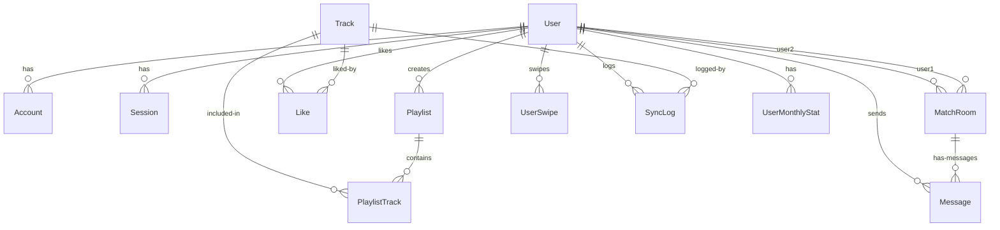

# 音樂數據與限時品味交流社交應用程式 (Music Social App) 工作交接文件 (Handover Document)

本文件旨在為接手本專案的開發人員提供完整的系統交接指南，包含專案的目標與功能、採用的技術棧、系統架構設計、資料庫結構以及程式碼庫的目錄規劃。

---

## 一、 專案目標與核心功能 (Goals & Core Features)

本專案旨在打造一款結合「音樂數據追蹤」與「限時品味交流」的社交應用程式，解決使用者難以客觀紀錄音樂喜好，以及在傳統社交軟體上面臨破冰障礙、品味同溫層等痛點。

### 1. 帳號驗證與串流平台連結 (Authentication & Platform Linking)
- **核心驗證**：使用者可透過 Google OAuth {Google 開放授權} 進行快速註冊與登入。
- **音樂平台連結**：登入後可透過 OAuth {開放授權} 連結 Spotify {Spotify 串流平台} 與 YouTube Music {YouTube Music 串流平台}（藉由 Google 帳號授權讀取 YouTube Data API {YouTube 資料應用程式介面}）。
- **目標**：無痛讀取使用者的真實聆聽軌跡，建立客觀的「音樂人格」。

### 2. 音樂人格與歌單管理 (Music Persona & Playlists)
- **交友歌單自訂**：使用者每日可挑選 5 首歌曲，並為每首歌曲自訂專屬的 30 秒精華播放區間（設定 `startTime` {開始時間} 與 `endTime` {結束時間}）。
- **音樂數據同步**：背景自動同步串流平台聆聽歷史，計算出最常聽藝人與單曲 Top 5 {前五名}。
- **背景主色調渲染**：系統能解析歌曲「專輯封面主色調」，在播放時對 UI/UX {使用者介面與體驗} 的全域背景進行單色渲染，強化沉浸感。

### 3. 品味配對機制 (Matching Mechanism)
- **配對池前提**：使用者必須先完成每日 5 首歌單配置方可進入配對池。
- **配對模式**：提供 `Similar` {相似曲風與共同藝人} 模式或 `Random` {隨機探索} 模式，每日提供 5 位推薦候選人。
- **滑動操作**：支援直覺的右滑喜歡（LIKE {喜歡}）、左滑跳過（SKIP {跳過}），使用者無需聽滿整首歌曲即可快速滑動。

### 4. 即時限時聊天室 (Real-time Chatroom)
- **48 小時倒數**：雙方皆按下 LIKE {喜歡} 後觸發配對，建立限時 48 小時聊天室，畫面上會顯示精確倒數計時。
- **同步聆聽功能**：在聊天室中可發送「同步播放」邀請，透過 Socket.io {Socket.io 即時通訊庫} 廣播，喚醒雙方本機端的第三方 App {應用程式} 實現同音軌同步播放。
- **雙盲選擇結算**：48 小時期限屆滿後，文字輸入功能鎖定，系統彈出「雙盲結算表單」（保留/結束）：
  - **雙方皆選擇保留 (KEEP)**：聊天室升級為永久好友（MATCHED {已配對}），移除時間限制。
  - **任一方選擇結束 (END) 或無回應**：對話框永久關閉，變更為唯讀歷史存檔（CLOSED {已關閉}）。

---

## 二、 系統技術棧 (Technology Stack)

本專案採用現代 Web {網頁} 開發與即時通訊技術，區分為 Frontend {前端網頁應用}、Backend {後端獨立服務} 與 Database {資料庫}。

| 領域 | 採用技術與工具 | 說明 |
| :--- | :--- | :--- |
| **核心框架** | Next.js {Next.js 網頁框架} | 用於主網頁應用前端 UI {使用者介面} 與 API Routes {應用程式介面路由}，採用 App Router {應用程式路由器}。 |
| **後端服務** | Express {Express 後端框架} | 獨立後端服務，位於 `services/backend`，負責處理核心業務邏輯與 API 端點。 |
| **即時通訊** | Socket.io {Socket.io 即時通訊庫} | 處理 WebSocket {WebSocket 網頁雙向通訊協定} 即時對話、同步聆聽廣播以及雙盲結算通知。 |
| **資料庫 ORM** | Prisma ORM {Prisma 物件關係對映工具} | 作為資料庫連線與查詢的抽象層，自動生成 TypeScript {TypeScript 程式語言} 的客戶端代碼。 |
| **資料庫系統** | PostgreSQL {PostgreSQL 關聯式資料庫} | 主要資料庫，儲存使用者、歌曲、歌單、配對與聊天訊息。 |
| **樣式設計** | Vanilla CSS {CSS 階層樣式表} | 全域與元件樣式使用原生 CSS {CSS 階層樣式表} 開發，確保極致的效能、高度靈活的 Glassmorphism {毛玻璃特效} 與過渡微動畫。 |
| **身分驗證** | NextAuth {NextAuth 驗證庫} | 負責 Google OAuth {Google 開放授權} 與 Spotify OAuth {Spotify 開放授權} 的 Session {工作階段} 管理與權限控制。 |
| **背景任務** | Node-cron {Node-cron 定時任務工具} | 用於定期觸發串流平台的聆聽歷史數據同步。 |
| **測試驗證** | Python Behave {Python 行為驅動測試框架} | 用於 BDD {行為驅動開發} 整合測試，驗證聊天室過期、雙盲選擇等複雜業務邏輯。 |

---

## 三、 資料庫設計 (Database Schema)

資料庫綱要定義於 `apps/web/prisma/schema.prisma`。以下為核心實體關係：



### 關鍵資料模型說明：
1. **User {使用者模型}**：儲存帳號基本欄位，並關聯配對、滑動、月度統計數據。
2. **Track {歌曲模型}**：儲存曲目 Metadata {元資料}，包含 `spotifyId`、`youtubeId`、專輯封面、試聽網址與專輯主色調 `dominantColor`。
3. **PlaylistTrack {歌單曲目關係}**：除了關聯外鍵，另包含 `startTime` 與 `endTime` 欄位以紀錄 30 秒精華片段區間，以及 `order` (1-5) 代表排序。
4. **UserSwipe {滑動紀錄}**：紀錄 `swiperId` 對 `targetId` 的動作（LIKE {喜歡} 或 SKIP {跳過}），加上唯一複合索引防止重複滑動。
5. **MatchRoom {配對聊天室}**：紀錄雙方使用者 ID、各自在雙盲階段的選擇（`user1Choice` / `user2Choice` 可為 "KEEP" 或 "END"）、配對狀態 `status`（ACTIVE {進行中} / CLOSED {唯讀} / MATCHED {已配對好友}）以及過期時間 `expiresAt`（系統預設配對時間 + 48 小時）。
6. **SyncLog {聽歌同步日誌}** 與 **UserMonthlyStat {月度統計}**：用於長期聆聽數據追蹤與每月數據歸檔，優化海量日誌的查詢效能。

---

## 四、 程式碼庫結構與交接模組 (Codebase Structure)

專案採用 Monorepo {單一程式碼庫} 的目錄規劃：

```
music-list/
├── apps/
│   └── web/                   # Next.js {Next.js 網頁框架} 主要前端與 API Routes {應用程式介面路由}
│       ├── app/
│       │   ├── api/           # Next.js API 端點 (包含 spotify, youtube, match, chat 等)
│       │   ├── chat/          # 即時聊天室頁面 (包含 [roomId]/page.tsx)
│       │   ├── dev-dash/      # 開發人員測試儀表板 (page.tsx)
│       │   ├── match/         # 滑動配對頁面
│       │   ├── playlist/      # 歌單編輯頁面 (edit/page.tsx)
│       │   └── profile/       # 個人音樂人格與數據儀表板
│       ├── components/        # 共用前端元件
│       ├── prisma/            # Prisma Schema {Prisma 資料庫綱要} 與遷移定義
│       └── server/
│           └── socket.ts      # 主要 WebSocket Server {網頁通訊協定伺服器}
├── services/
│   ├── backend/               # 獨立 Express {Express 後端框架} 後端服務 (主要運行 business logic)
│   │   ├── src/
│   │   │   ├── routes/        # API 路由分類 (chat, match, music, user)
│   │   │   └── server.ts      # Express {Express 後端框架} 伺服器啟動與 Socket.io 基礎連線
│   └── bdd/                   # Python Behave {Python 行為驅動測試框架} 測試環境
└── docs/                      # 系統開發規劃與設計文件
```

### 重點交接程式碼檔案：
- **`apps/web/server/socket.ts`**：WebSocket {網頁雙向通訊協定} 伺服器，直接監聽連接，負責 48 小時倒數計時（伺服器端每 5 秒進行 tick 檢測，並在過期時自動將狀態更新為 CLOSED {已關閉}）、聊天訊息即時廣播、同音軌同步聆聽發起與接受、以及雙盲結算投票的即時處理。
- **`apps/web/app/api/youtube/liked-videos/route.ts`**：使用 Google OAuth Access Token {Google 開放授權存取權杖} 向 YouTube Data API v3 {YouTube 資料應用程式介面第三版} 抓取音樂類別 (videoCategoryId=10) 且符合官方發行特徵（包含 "Provided to YouTube by" 或以 "- Topic" 結尾）的 5 首喜歡歌曲，轉化為音樂日誌來源。
- **`apps/web/app/chat/[roomId]/page.tsx`**：聊天室前端頁面，實作了 WebSocket {網頁雙向通訊協定} 的監聽連線、本地倒數時間同步、同步聆聽音樂播放邀請的 UI 彈出窗、以及當倒數歸零時自動轉為唯讀並開啟雙盲選擇面板的互動介面。
- **`apps/web/app/playlist/edit/page.tsx`**：交友歌單自訂 UI {使用者介面}，使用者可透過滑桿 (Slider) 自由調整每首歌的 30 秒起點，並串接 Spotify API {Spotify 應用程式介面} 進行搜尋與 Top 10 {前十首} 推薦曲目的加入。
- **`apps/web/app/dev-dash/page.tsx`**：開發人員控制台，支援測試帳號的建立、假資料注入、一鍵重設配對歷史、模擬對方對我點讚等功能，利於日常偵錯。

---

## 五、 開發與運行指引 (Execution Guide)

### 1. 環境變數配置 (Environment Variables)
在 `apps/web/.env` 設定以下關鍵環境變數：
- `DATABASE_URL` {資料庫連線網址}：指向 PostgreSQL {PostgreSQL 關聯式資料庫}。
- `GOOGLE_CLIENT_ID` / `GOOGLE_CLIENT_SECRET`：Google OAuth {Google 開放授權} 用憑證。
- `SPOTIFY_CLIENT_ID` / `SPOTIFY_CLIENT_SECRET`：Spotify {Spotify 串流平台} 開發者帳號憑證。
- `NEXTAUTH_SECRET`：NextAuth {NextAuth 驗證庫} 加密金鑰。
- `NEXTAUTH_URL`：本機開發為 `http://127.0.0.1:3001`。

### 2. 啟動指令 (Running the App)
- **前端開發伺服器**：在 `apps/web` 目錄下執行 `npm run dev`（運行於埠號 3001）。
- **WebSocket 伺服器**：執行 `npm run start:socket`（運行於埠號 3002，由 `apps/web/server/socket.ts` 啟動）。
- **後端輔助服務**：在 `services/backend` 下執行對應的啟動指令。
- **資料庫同步**：修改 Schema {資料庫綱要} 後執行 `npx prisma db push` 或 `npx prisma migrate dev`。
